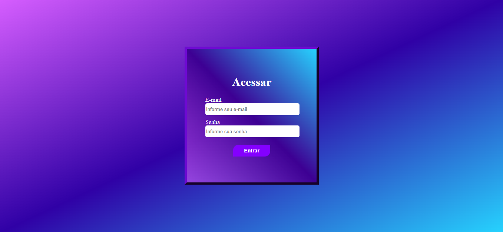
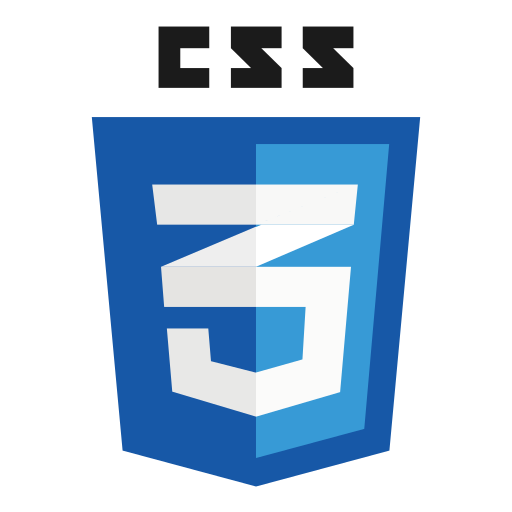

# 🔐 Projeto Tela de Login Autoral

    Projeto acadêmico de interface de login desenvolvido com HTML e CSS puro.

## 🔴 Indíce
1. [Descrição](#-descrição)
2. [Demonstração da Aplicação](#-demonstração-da-aplicação)
3. [Ferramentas Utilizadas](#️-ferramentas-utilizadas)
4. [Como Executar](#-como-executar)
5. [Autor](#-autor)

## 📋 Descrição
&emsp;&emsp; Este projeto consiste no desenvolvimento de uma tela de login construída do zero, sem o uso de frameworks, com foco no aprendizado de conceitos básicos de HTML e breve exploração das possibilidades com CSS.  
&emsp;&emsp; O projeto foi desenvolvido como atividade prática na Unicesumar, sob orientação do Professor [Leonardo Rocha](https://github.com/leonardossrocha). No momento o projeto apresenta apenas a interface gráfica, sem qualquer funcionalidade implementada.

## 📸 Demonstração da Aplicação

    

## 🛠️ Ferramentas Utilizadas
 &nbsp;  &nbsp; 

## 🚀 Como Executar
Utilizando o git clone, clone o repositório para seu dispositivo local e abra o index.html  

⚠️ Necessário ter o Git já devidamente instalado, e configurado em seu computador.  

Para clonar o repositório, acesse a pasta do seu computador através do terminal (VSCode, CMD).  
Utilize: cd + (endereço da pasta). Exemplo: cd C:\Users\usuário\documentos\projetos  
Utilize: git clone + repositório. Exemplo: git clone https://github.com/niveasofia/projeto-login-autoral.git  
Após a clonagem do repositório, localize a pasta onde ele foi clonado.  
O git clone baixa o repositório em seu computador, como uma pasta.  
Abra a pasta clonada, no explorador de arquivos do seu computador.  
Abra o arquivo index.html no navegador.  

## 👨‍🏫 Autor
[Nivea Sofia](https://github.com/niveasofia)